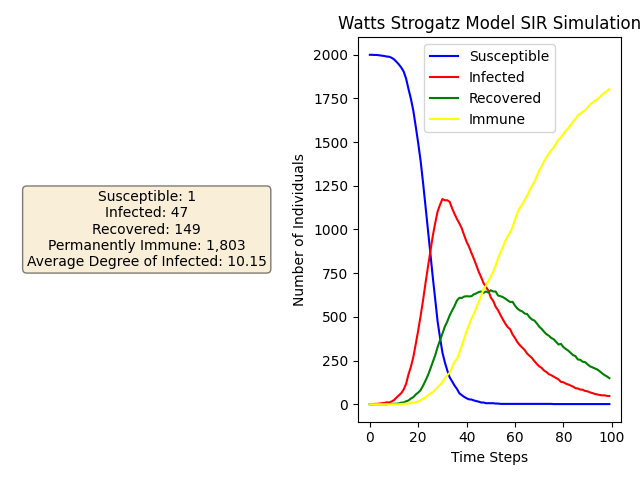
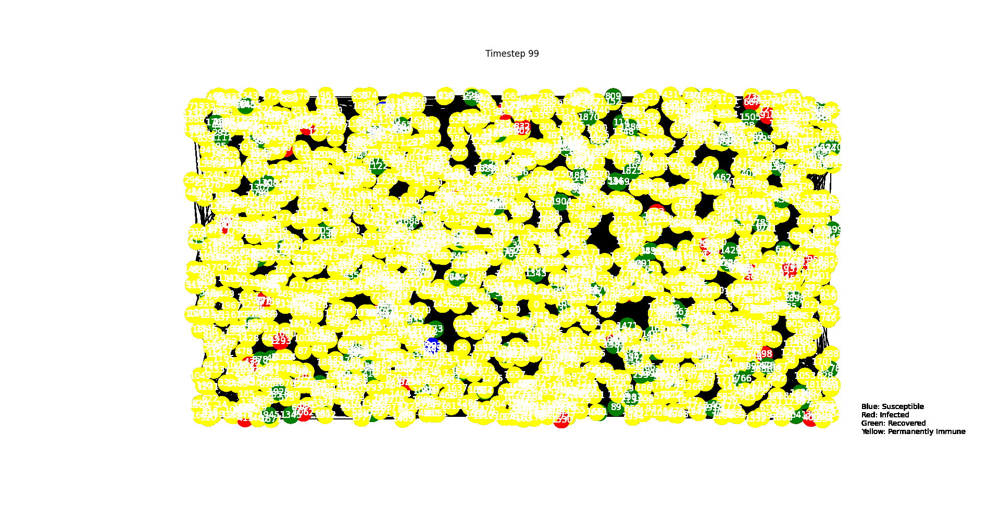

## Parameters
Number of nodes = 1000  
Infection rate = 0.3  
k = 10  
p = 0.3 

## Graphs
### Watts-Strogatz Model

## List of 10 Nodes and their stats
| Name                     |   Betweenness Centrality |   Clustering Coefficient | Degree   |   Eigenvector Centrality |   Load Centrality |
|:-------------------------|-------------------------:|-------------------------:|:---------|-------------------------:|------------------:|
| Albert Einstein          |              0.00161683  |                 0.194444 | (0, 9)   |                0.017922  |       0.00160785  |
| Isaac Newton             |              0.00122982  |                 0.309091 | (1, 11)  |                0.0202728 |       0.00120288  |
| Leonardo da Vinci        |              0.00138851  |                 0.311111 | (2, 10)  |                0.0201541 |       0.00137178  |
| William Shakespeare      |              0.0015123   |                 0.311111 | (3, 10)  |                0.0210076 |       0.00150302  |
| Charles Darwin           |              0.00154256  |                 0.333333 | (4, 10)  |                0.021886  |       0.00153423  |
| Galileo Galilei          |              0.000949766 |                 0.25     | (5, 8)   |                0.017361  |       0.000949061 |
| Aristotle                |              0.000908274 |                 0.361111 | (6, 9)   |                0.0196991 |       0.00088489  |
| Plato                    |              0.00220101  |                 0.290909 | (7, 11)  |                0.0250849 |       0.00221724  |
| Socrates                 |              0.00295686  |                 0.181818 | (8, 12)  |                0.0270284 |       0.00297629  |
| Alexander the Great      |              0.00126678  |                 0.222222 | (9, 10)  |                0.0209725 |       0.00124506  |
